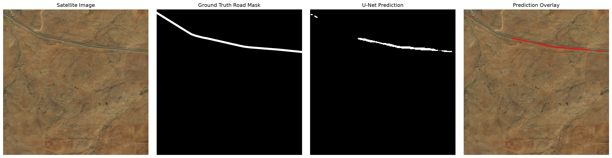
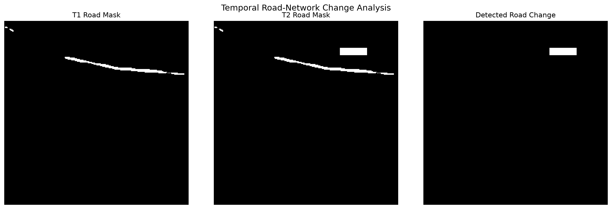
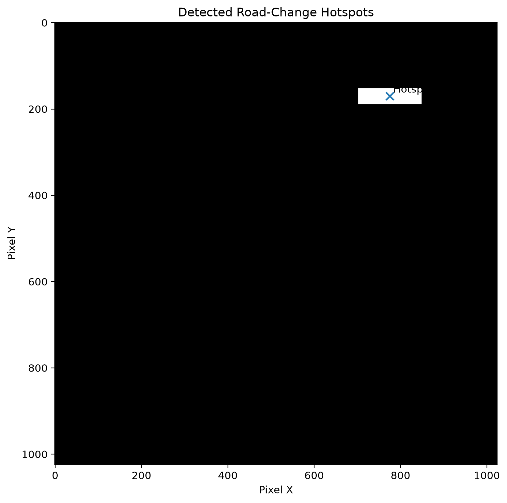

# Project Showcase


## Road Network Extraction & Infrastructure Change Detection Using Multi-Temporal Satellite Imagery


### Research Prototype


A remote-sensing and geospatial AI prototype for extracting road networks from satellite imagery and analyzing spatial changes between image dates.


---


## 1. Research Objective


The project investigates whether deep-learning segmentation and temporal change detection can be combined with GIS processing to extract road networks and identify spatial changes in remotely sensed imagery.


### Research Question


> Can deep learning extract road networks from satellite imagery and identify spatial changes between two time periods?


---


## 2. System Architecture


```text

Satellite Imagery

&#x20;       |

&#x20;       v

&#x20;  Preprocessing

&#x20;       |

&#x20;       +-----------------------+

&#x20;       |                       |

&#x20;       v                       v

&#x20;Road Segmentation       Change Detection

&#x20;    U-Net                Siamese CNN

&#x20;       |                       |

&#x20;       v                       v

&#x20;Road Masks T1/T2       Change Probability

&#x20;       |                       |

&#x20;       +-----------+-----------+

&#x20;                   |

&#x20;                   v

&#x20;             GIS Analysis

&#x20;                   |

&#x20;         +---------+---------+

&#x20;         |         |         |

&#x20;         v         v         v

&#x20;      Vector   Statistics  Hotspots

&#x20;      Network

&#x20;         |

&#x20;         v

&#x20;   Visualization

```


---


## 3. Datasets


### DeepGlobe Road Extraction


Used for the road-segmentation component.


* 5,000 image/mask pairs

* 1,024 × 1,024 source imagery

* Binary road masks

* 4,000 training samples

* 1,000 validation samples

* Additional 500/100 medium experiment


### LEVIR-CD


Used for validating the paired temporal change-detection component.


* 637 total image pairs

* 445 training pairs

* 64 validation pairs

* 128 test pairs

* 1,024 × 1,024 imagery


**Dataset limitation:** LEVIR-CD contains building changes rather than road changes. Therefore, its results validate the change-detection component rather than proving road-construction detection.


---


## 4. Road Segmentation


A baseline U-Net was trained for binary road segmentation.


### Configuration


* Input: 256 × 256

* Training samples: 500

* Validation samples: 100

* Batch size: 2

* Epochs: 2

* Optimizer: AdamW

* Learning rate: 1e-4

* Loss: BCE + Dice


### Validation Result


**IoU: 0.1871**


Additional evaluated metrics:


* Precision

* Recall

* Dice/F1

* IoU


---


## 5. Road Network Extraction


The predicted segmentation mask is transformed into a road-network representation through:


1\. Binary thresholding

2\. Morphological cleanup

3\. Skeletonization

4\. Connected-component extraction

5\. Line vectorization

6\. GeoJSON export


Example for sample `142436`:


* Skeleton pixels: 664

* Line features: 4

* Network length: 799.99 pixel units


### GIS limitation


The current vectors use raster pixel coordinates rather than geographic coordinates.


Therefore, physical distances in meters or kilometers are not claimed.


---


## 6. Temporal Change Detection


A lightweight Siamese CNN was implemented using:


* Shared encoder

* Absolute feature difference

* Binary change head

* Weighted BCE + Dice loss


### Improved experiment


* Positive-class weight: 4.0

* Input: 256 × 256

* Batch size: 2

* Epochs: 6

* Optimizer: AdamW

* Learning rate: 1e-4

* Validation-selected threshold: 0.45


---


## 7. Held-Out Change-Detection Results


Evaluation was performed on the 128-image LEVIR-CD test split.


| Metric    | Result |

| --------- | -----: |

| Precision | 0.3078 |

| Recall    | 0.4460 |

| Dice / F1 | 0.3642 |

| IoU       | 0.2226 |


These results describe change detection on LEVIR-CD and should not be interpreted as road-construction accuracy.


---


## 8. GIS Road-Change Analysis


A separate GIS module compares two aligned binary road masks.


It calculates:


* Added road pixels

* Removed road pixels

* Total changed pixels

* Connected change components

* Change hotspots


### Controlled validation


A synthetic T2 road mask was generated from sample `142436` to validate the GIS pipeline.


Results:


* T1 road pixels: 9,216

* T2 road pixels: 15,407

* Added pixels: 6,191

* Removed pixels: 0

* Changed pixels: 6,191

* Detected hotspots: 1


This is a controlled software-pipeline validation, not a real temporal road-change observation.


---


## 9. Visual Results


### Road Segmentation





### Road-Change Analysis





### Change Hotspots





---


## 10. Key Technical Components


### Machine Learning


* PyTorch

* U-Net

* Siamese CNN

* Binary segmentation

* Weighted loss functions

* Threshold analysis


### Remote Sensing


* Satellite imagery

* Multi-temporal image pairs

* Raster processing

* Image masks


### GIS


* Rasterio

* GeoPandas

* Shapely

* scikit-image

* Skeletonization

* GeoJSON

* Folium


### Evaluation


* Precision

* Recall

* Dice/F1

* IoU

* Confusion matrix

* Qualitative visualization


---


## 11. Limitations


The current prototype has several important limitations:


1\. The road-segmentation experiment is a short baseline.

2\. The DeepGlobe split is random rather than region-aware.

3\. Current road vectors use pixel coordinates.

4\. Geographic road length is not yet available.

5\. LEVIR-CD contains building changes rather than road changes.

6\. Synthetic road-change analysis does not represent real temporal observations.

7\. Real infrastructure-change analysis requires genuinely paired, aligned, georeferenced imagery.

8\. Illumination, seasonality, shadows, clouds, registration errors, and resolution differences can create false changes.


---


## 12. Research Gap


The main research gap is the lack of a genuinely paired, georeferenced road/infrastructure change dataset integrated with the road-extraction pipeline.


A stronger future system should connect:


```text

Georeferenced T1 Imagery

&#x20;         |

&#x20;         v

&#x20;  Road Segmentation

&#x20;         |

&#x20;         v

&#x20;    Road Network

&#x20;         |

&#x20;         |

Georeferenced T2 Imagery

&#x20;         |

&#x20;         v

&#x20;  Road Segmentation

&#x20;         |

&#x20;         v

&#x20;    Road Network

&#x20;         |

&#x20;         v

&#x20;  Network Difference

&#x20;         |

&#x20;         v

&#x20;Physical Road Changes

```


This would allow road-length changes, connectivity changes, newly constructed segments, removed segments, and spatial hotspots to be measured in geographic coordinates.


---


## 13. Future Work


* Obtain genuinely paired road/infrastructure change imagery.

* Use georeferenced multi-temporal satellite imagery.

* Implement region-aware dataset splitting.

* Compare U-Net with SegFormer or DeepLabV3+.

* Improve Siamese change detection.

* Add image registration and temporal normalization.

* Build a proper road graph from skeletons.

* Transform pixel coordinates into geographic coordinates.

* Calculate road length and density in physical units.

* Perform intersection and connectivity analysis.

* Expand hotspot analysis.

* Conduct more extensive error analysis.


---


## 14. Research Positioning


This project should be presented as:


> **A research prototype for road-network extraction and infrastructure change analysis using remote sensing and geospatial AI.**


It should not be presented as an operational system for illegal-construction detection, real-time highway monitoring, or government infrastructure surveillance.


---


## 15. Project Status


### Completed


* Dataset acquisition and verification

* Dataset splitting

* U-Net road segmentation baseline

* Road prediction

* Skeletonization

* Road-network vectorization

* Network statistics

* Siamese change detection

* Weighted change-detection experiment

* Threshold analysis

* Held-out test evaluation

* Change visualization

* Road-mask difference analysis

* Synthetic temporal validation

* Change-hotspot extraction

* Interactive network-map generation

* GitHub repository packaging


### Current Status


**Research prototype completed and documented.**


The next major technical research step is integration with genuinely paired, georeferenced road/infrastructure imagery.


---


## Repository


GitHub:


https://github.com/sritamraj/road-infrastructure-change-ai


